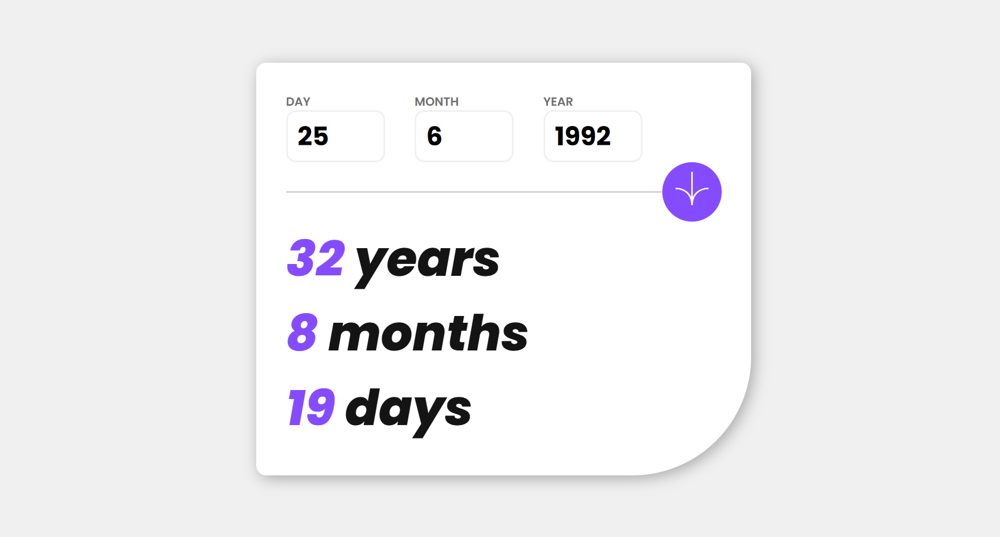

# Age Calculator



## Description
An interactive web application that calculates a person's age based on their date of birth. Built using HTML, CSS, and JavaScript.

## Features
- User-friendly interface
- Calculates accurate age in years, months, and days
- Instant results upon entering date of birth
- Responsive design for all devices

## Technologies Used
- HTML
- CSS
- JavaScript

## How to Use
1. Enter your date of birth in the input field.
2. Click the button.
3. View your age displayed in years, months, and days.

## Installation
1. Clone the repository:
   ```bash
   git clone https://github.com/Amine4jh/age-calculator.git
   ```
2. Open `index.html` in your web browser.

## Mobile Preview

